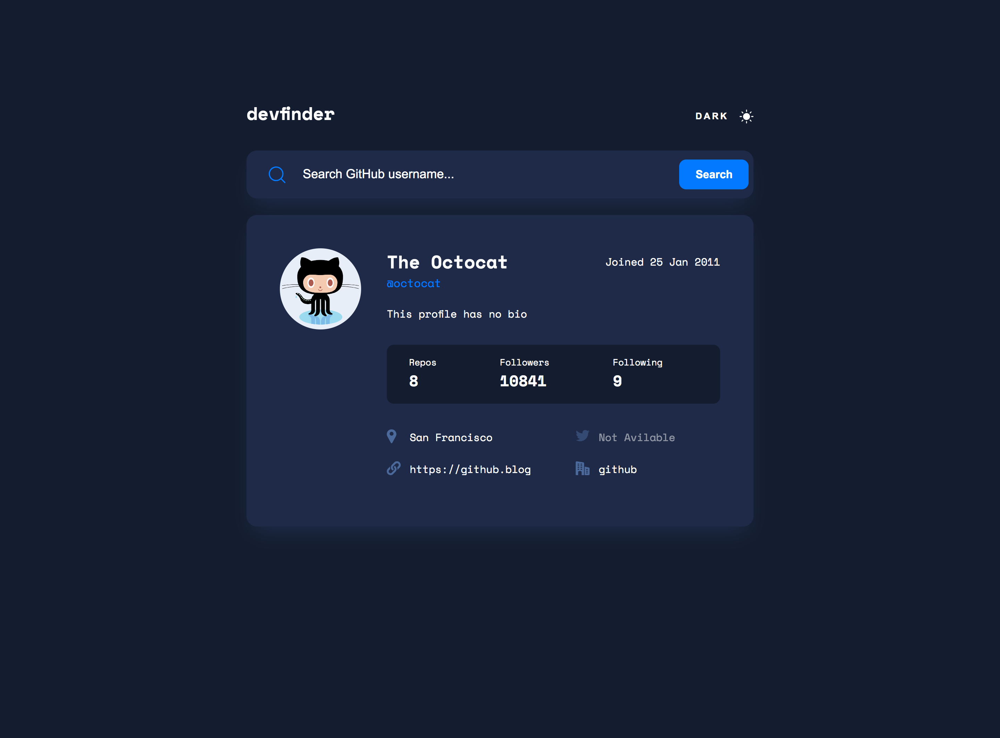

# Frontend Mentor - GitHub user search app solution

This is a solution to the [GitHub user search app challenge on Frontend Mentor](https://www.frontendmentor.io/challenges/github-user-search-app-Q09YOgaH6). Frontend Mentor challenges help you improve your coding skills by building realistic projects.

## Table of contents

- [Overview](#overview)
  - [The challenge](#the-challenge)
  - [Screenshot](#screenshot)
  - [Links](#links)
- [My process](#my-process)
  - [Built with](#built-with)
  - [What I learned](#what-i-learned)
- [Author](#author)

## Overview

### The challenge

Users should be able to:

- View the optimal layout for the app depending on their device's screen size
- See hover states for all interactive elements on the page
- Search for GitHub users by their username
- See relevant user information based on their search
- Switch between light and dark themes
- **Bonus**: Have the correct color scheme chosen for them based on their computer preferences. _Hint_: Research `prefers-color-scheme` in CSS.

### Screenshot

### Links

- Solution URL: [Add solution URL here](https://github.com/Sanja-Misic/GitHub-user-search-app)
- Live Site URL: [Add live site URL here](https://sanja-misic.github.io/GitHub-user-search-app/)

## My process

### Built with

- Semantic HTML5 markup
- Flexbox
- CSS Grid
- Sass preprocessor
- Mobile-first workflow

### What I learned

During this project, I gained valuable experience in several key areas. Here are some of the most important lessons I learned:

1. Using APIs with async-await Methods
   One of the most crucial skills I acquired in this project was utilizing APIs and asynchronous functions to efficiently retrieve data. This allowed me to dynamically update information on the application and provide users with fresh data.

2. Theme Switching (Light/Dark mode)
   I learned how to implement a theme toggle for the application, allowing users to switch between light and dark modes. This is important for catering to users with different interface preference.

3. Utilizing Flexbox and Grid Styles
   I gained a deeper understanding of how to efficiently manage the layout of elements on a page using Flexbox and Grid styles. This enabled me to design responsive and visually appealing user interfaces.

4. Working with the SCSS Preprocessor
   I learned how to use SCSS to organize and enhance my styles. SCSS allowed me to utilize variables, nested styles, and many other advanced features.

These learned skills significantly enhanced my web development abilities.

## Author

- Website - [Add your name here](https://sanja-misic.github.io/My-portfolio-website/)
- Frontend Mentor - [@yourusername](https://www.frontendmentor.io/profile/Sanja-Misic)
